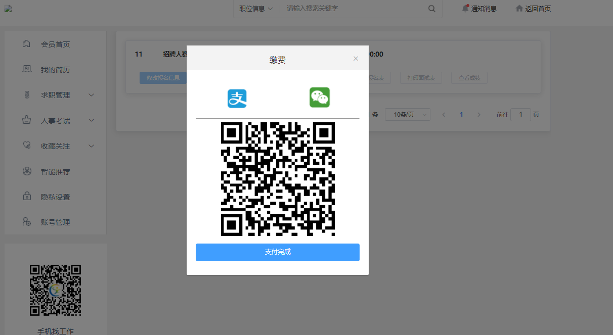

## 缴费 <!-- {docsify-ignore} -->

- 报名完成后在<a href="/doc/#/pc/regin/examPay">我的报名</a>中笔试缴费按钮激活点击笔试缴费即弹出缴费方式
- 笔试完成后可查询成绩,如果需要面试则如果进入面试则面试缴费按钮激活,点击即可缴费
- 可选支付宝与微信支付(图 1-1)
### 图 1-1<!-- {docsify-ignore} -->

