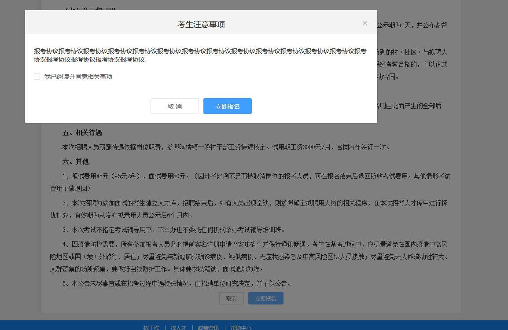

## 报名 <!-- {docsify-ignore} -->

- 点击需要帮忙报名的招考后进入报名页面(图 1-1)
- 点击立即报名并,仔细阅读报考要求并勾选协议(图 1-2)
- 填写基本信息(图1-3)
- 填写教育/工作经历等(图1-4)
- 上传必要的照片(图 1-5)
- 点击提交报名
- 进入我的报考中查看
### 图 1-1<!-- {docsify-ignore} -->

### 图 1-2<!-- {docsify-ignore} -->

### 图 1-3<!-- {docsify-ignore} -->

### 图 1-4<!-- {docsify-ignore} -->

### 图 1-5<!-- {docsify-ignore} -->

