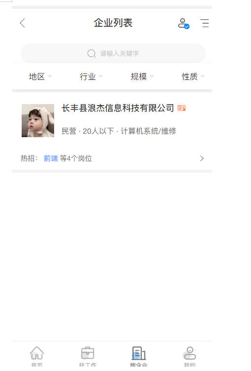

## 手机端 <!-- {docsify-ignore} -->

  > 手机端
    展示主要操作栏。
    名企推荐，附近岗位推荐。
    可以查看热门招聘岗位，以及最新岗位
    查看新闻资讯

- 1.企业风采: 
- 按分类，展示个企业详情介绍，点击后将会展示，企业视频介绍，文字简介。    
- 2.找工作:
- 可以筛选查看自己想申请的岗位。查看职位详情，了解更多职位信息，同时可以把岗位分享给更多合适的人。点击收藏，可以在会员中心-求职管理中查看。
- 3.附近职位:
- 将根据您填写的地址，就近为您匹配岗位
- 4.找企业:
- 可以筛选查看自己心仪的企业，同时右侧也会筛选优质企业可以选择;可以点击查看企业详情，查看企业基本信息，关注企业，将在管理中心，关注企业中可以查看到。
- 5.政策资讯:
- 根据 最新资讯 、人才政策、 简历指南 、面试宝典 、职场八卦、 劳动法苑 、职场观察。等分类展示海量咨询内容
- 6.网络招聘会
  企业可以点击企业参会按钮，网站管理员对您申请进行审核，审核通过后。您的企业将展示在企业大厅，求职者可以看到您正在招聘的岗位，投简历。
求职者可以点击个人参会按钮，网站管理员对您申请进行审核，审核通过后。您的个人信息将展示在求职责大厅，招聘人员可以看到简历信息，邀请您加入企业。
- 7.会员中心
企业端
展示您的账户概况，下载记录，收藏简历，面试邀请，浏览记录等
发职位，您可以编辑您的岗位要求待遇发布，也可以刷新简历，将优先会在求职者中查看到。
同时可以生成二维码转发朋友圈。

- 8.刷新岗位:
求职者将优先看到你发布的岗位。遇发布，也可以刷新简历，将优先会在求职者中查看到。
同时可以生成二维码转发朋友圈。

- 9.职位管理:
可以对您发布所有岗位进行查看，匹配，修改，删除操作。

- 10.人才搜索
搜索查看您需要的人才，发送面试邀请

- 10.求职管理
可以查看到，应聘者投递的简历，同意接受后，可以邀请面试，也可以查看到自己下载，面试邀请等操作记录,可以邀请合适的用户面试。

### 图 1-1<!-- {docsify-ignore} -->

### 图 1-2<!-- {docsify-ignore} -->

### 图 1-3<!-- {docsify-ignore} -->

### 图 1-4<!-- {docsify-ignore} -->

### 图 1-5<!-- {docsify-ignore} -->

### 图 1-6<!-- {docsify-ignore} -->

### 图 1-7<!-- {docsify-ignore} -->

### 图 1-8<!-- {docsify-ignore} -->

### 图 1-9<!-- {docsify-ignore} -->

### 图 1-10<!-- {docsify-ignore} -->

### 图 1-11<!-- {docsify-ignore} -->

### 图 1-12<!-- {docsify-ignore} -->

### 图 1-13<!-- {docsify-ignore} -->

### 图 1-14<!-- {docsify-ignore} -->

### 图 1-15<!-- {docsify-ignore} -->

### 图 1-16<!-- {docsify-ignore} -->

### 图 1-17<!-- {docsify-ignore} -->

### 图 1-18<!-- {docsify-ignore} -->

### 图 1-19<!-- {docsify-ignore} -->

### 图 1-20<!-- {docsify-ignore} -->

