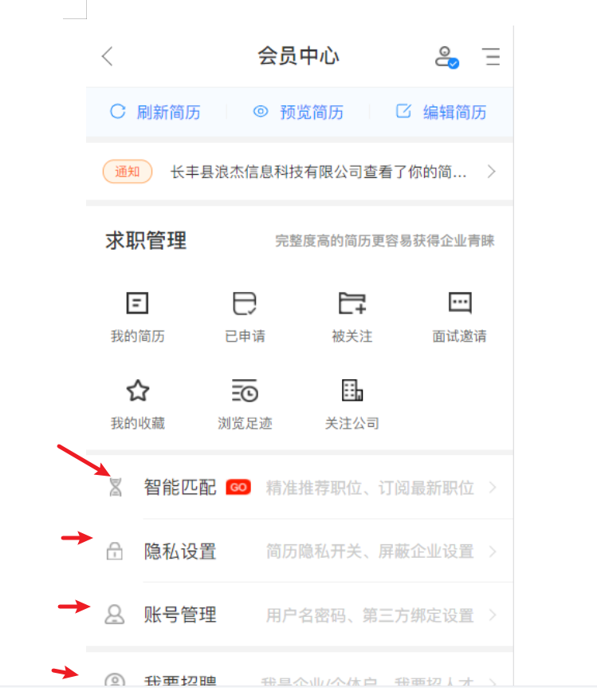

## 手机端个人端 <!-- {docsify-ignore} -->

- 1.个人端
展示您的账户概况，查看编辑简历，申请记录，收藏岗位企业信息，面试邀请，浏览记录等。

- 2.简历编辑预览刷新
简历刷新，将提高您在其他竞聘者中排名。
您可以添加，编辑求职状态，求职要求，教育经历，工作经历等。帮助招聘者更好了解自己，获得面试机会。

- 3.求职管理
求职管理。可以查看我投递，面试邀请，对我感兴趣，以及我收藏的，我的足迹等记录

- 4.智能匹配
为您推荐符合您岗位要求的职位。

- 5.隐私设置
可以让您的简历对设置的企业隐藏，保证您的隐私安全

- 6.账号管理
可以对您的账户信息，以及账号密码重新设置

### 图 1-1<!-- {docsify-ignore} -->

### 图 1-2<!-- {docsify-ignore} -->

### 图 1-3<!-- {docsify-ignore} -->

### 图 1-4<!-- {docsify-ignore} -->

### 图 1-5<!-- {docsify-ignore} -->

