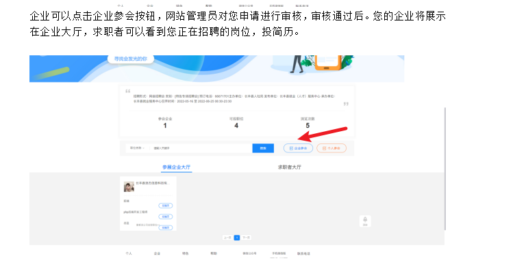
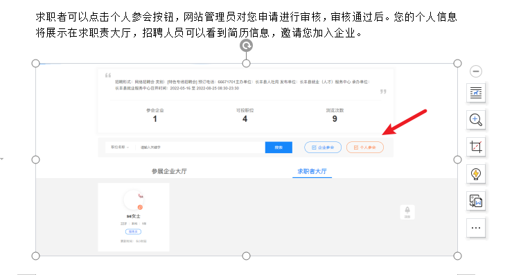

## 招聘会 <!-- {docsify-ignore} -->

  > 招聘会列表，求职者可以参加正在进行中的招聘会

- 招聘流程如下
- 1.企业可以点击企业参会按钮，网站管理员对您申请进行审核，审核通过后。您的企业将展示在企业大厅，求职者可以看到您正在招聘的岗位，投简历。
- 2.求职者可以点击个人参会按钮，网站管理员对您申请进行审核，审核通过后。您的个人信息将展示在求职责大厅，招聘人员可以看到简历信息，邀请您加入企业。

### 图 1-1<!-- {docsify-ignore} -->

### 图 1-2<!-- {docsify-ignore} -->

### 图 1-3<!-- {docsify-ignore} -->

