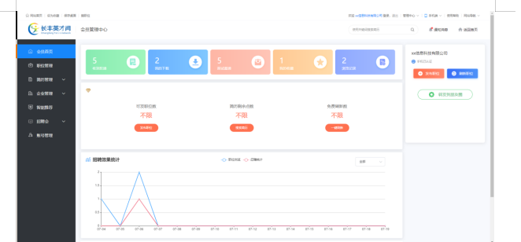
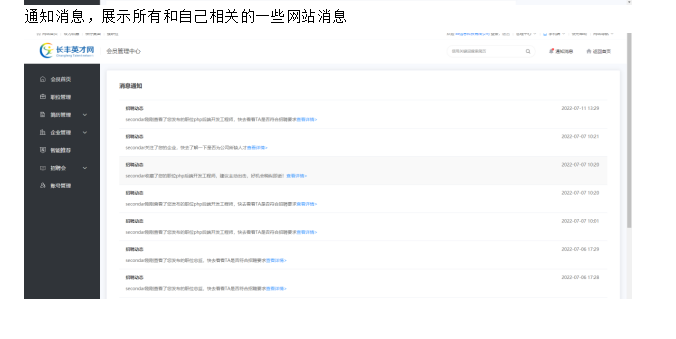
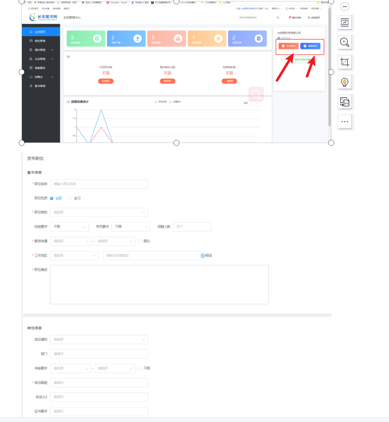
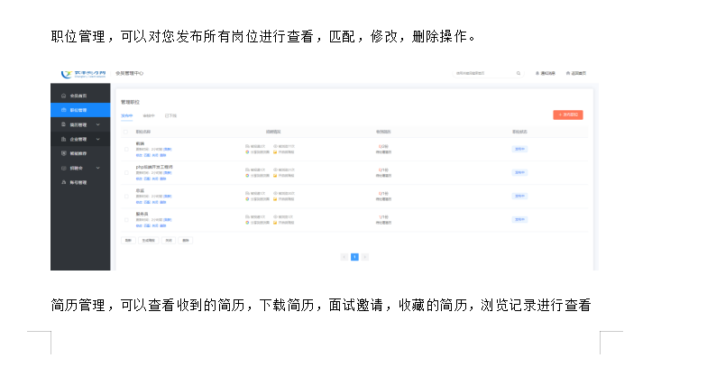
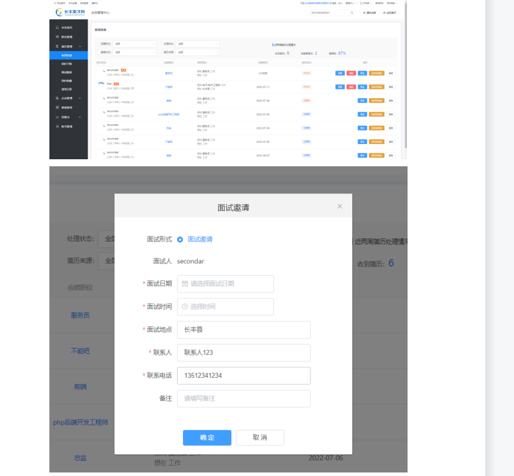
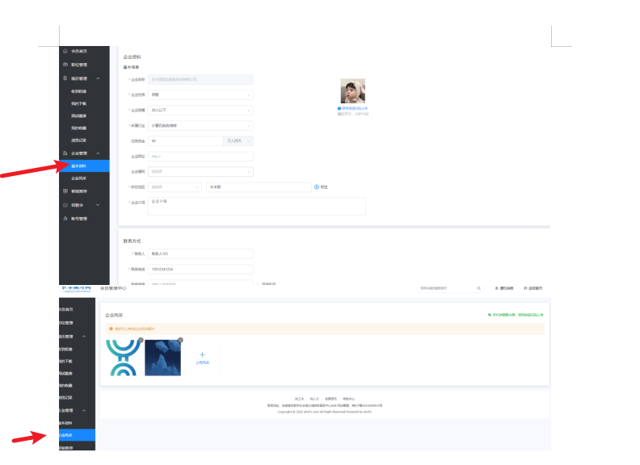
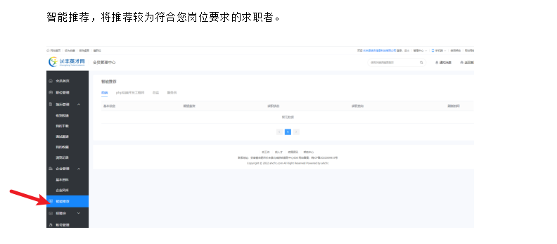
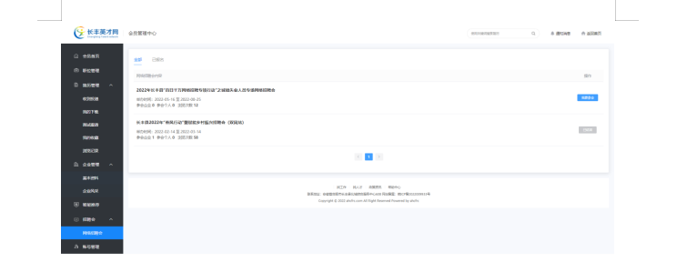
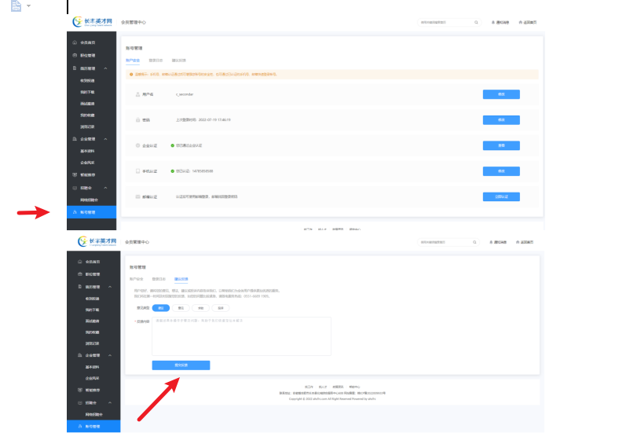

## 管理中心 <!-- {docsify-ignore} -->

  > 企业端
     会员首页
    展示您的账户概况，下载记录，收藏简历，面试邀请，浏览记录等。

  
- 1.通知消息，展示所有和自己相关的一些网站消息。
- 2.发简历，您可以编辑您的岗位要求待遇发布，也可以刷新简历，将优先会在求职者中查看到, 同时可以生成二维码转发朋友圈。
- 3.职位管理，可以对您发布所有岗位进行查看，匹配，修改，删除操作。
- 4.简历管理，可以查看收到的简历，下载简历，面试邀请，收藏的简历，浏览记录进行查看
- 5.点击同意，可以发送面试邀请。
- 6.企业管理可以维护修改企业信息。同时可以上传企业照片，帮助求职者更好了解企业。
- 7.智能推荐，将推荐较为符合您岗位要求的求职者。
- 8.招聘会，您可以参加，正在进行的招聘会，帮助您找到合适的人才。（详情可见招聘会栏目）。
- 9.账号管理，您可以对账户信息进行编辑设置，查看登录记录，同时您有一些好的想法，或遇到什么问题都可以向我们反馈。

### 图 1-1<!-- {docsify-ignore} -->

### 图 1-2<!-- {docsify-ignore} -->

### 图 1-3<!-- {docsify-ignore} -->

### 图 1-4<!-- {docsify-ignore} -->

### 图 1-5<!-- {docsify-ignore} -->

### 图 1-6<!-- {docsify-ignore} -->

### 图 1-7<!-- {docsify-ignore} -->

### 图 1-8<!-- {docsify-ignore} -->

### 图 1-9<!-- {docsify-ignore} -->

