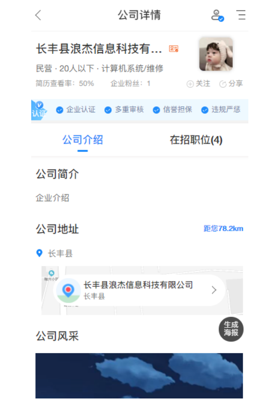
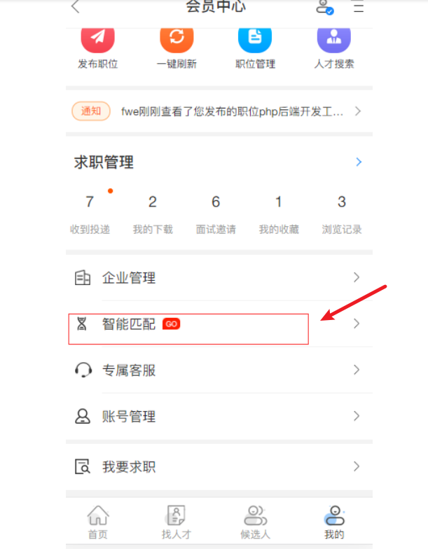
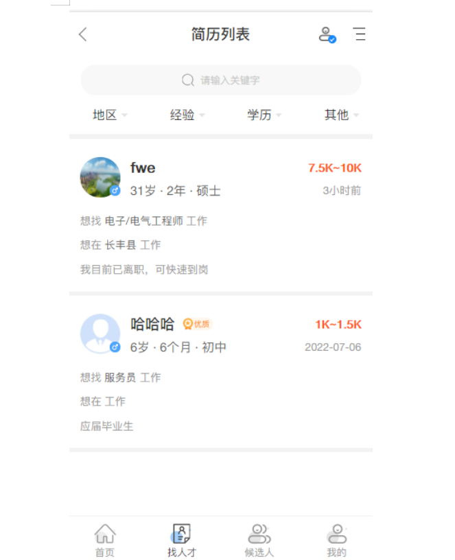
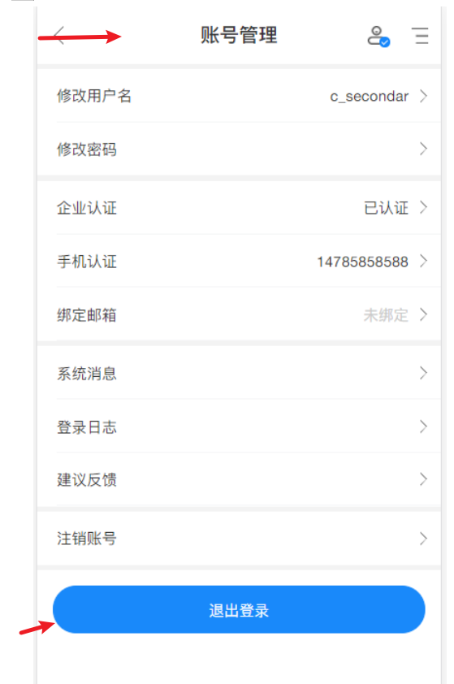

## 企业管理 <!-- {docsify-ignore} -->

 - 1.企业管理: 
 - 企业管理可以维护修改企业信息。同时可以上传企业照片，帮助求职者更好了解企业。同事可以生成海报，转发社交圈子，让更多的人了解企业情况，帮助企业更快的找到合适人才。
   
- 2.智能匹配
为您推荐符合您岗位要求的用户。

- 3.账号管理
可以对您的账户信息，以及账号密码重新设置

### 图 1-1<!-- {docsify-ignore} -->

### 图 1-2<!-- {docsify-ignore} -->

### 图 1-3<!-- {docsify-ignore} -->

### 图 1-4<!-- {docsify-ignore} -->

### 图 1-5<!-- {docsify-ignore} -->

### 图 1-6<!-- {docsify-ignore} -->
