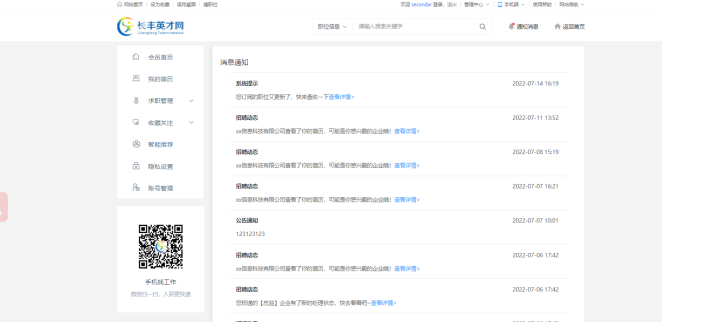

## 个人端 <!-- {docsify-ignore} -->

  > 个人端
    首页展示所有个人一些操作信息，账户概览：我的足迹，对我感兴趣，面试邀请，我的投递。
    求职信息概述。
    公开状态：关闭后企业将无法搜索到您的简历信息。

- 1.通知消息，展示所有和自己相关的一些网站消息
- 2.可以修改上传简历信息，预览简历，点击刷新简历，可以提高您在招聘者中查看排名，提高您被选中概率。
- 3.求职管理。可以查看我投递，面试邀请，对我感兴趣，我的足迹等记录
- 4.收藏与关注，可以查看到您收藏的职位，关注的企业，同时可以订阅职位，有符合您要求的职位，将会通知您。
- 5.智能推荐:将推荐较为符合您求职要求的岗位。
- 6.隐私设置，可以设置简历转态，姓名匿名处理，以及屏蔽企业，将不会看到您的简历信息
- 7.账号管理，您可以对账户信息进行编辑设置，查看登录记录，同时您有一些好的想法，或遇到什么问题都可以向我们反馈

### 图 1-1<!-- {docsify-ignore} -->

### 图 1-2<!-- {docsify-ignore} -->

### 图 1-3<!-- {docsify-ignore} -->

