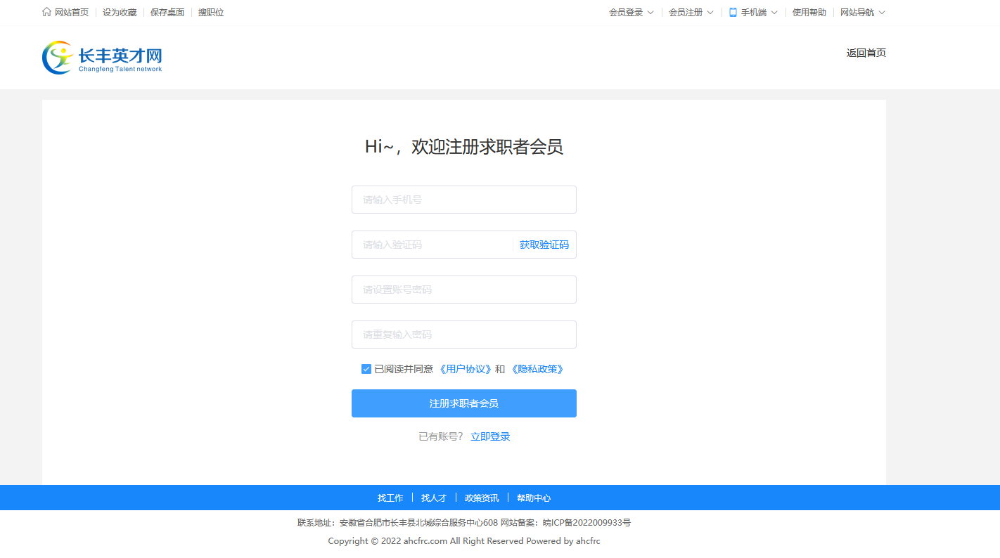
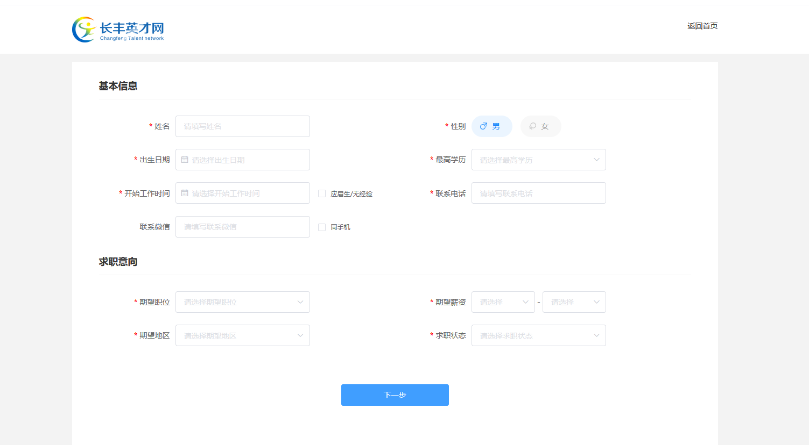
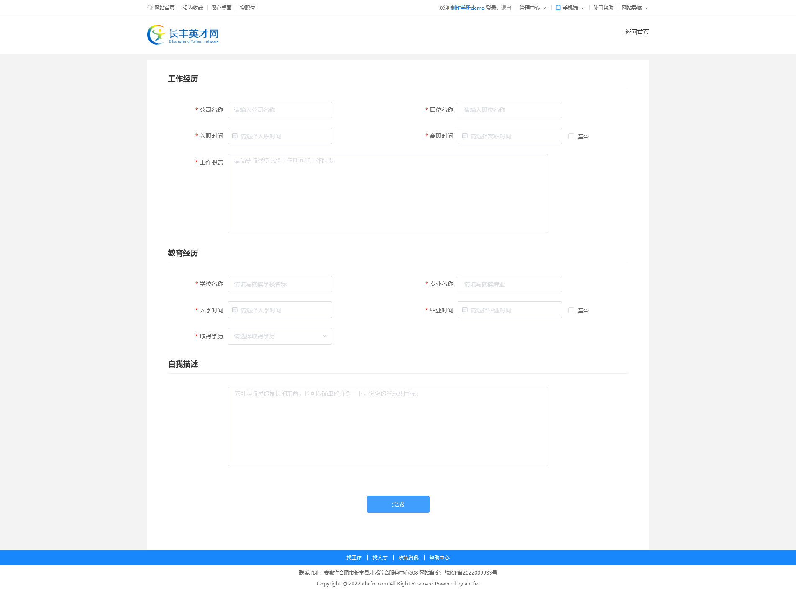
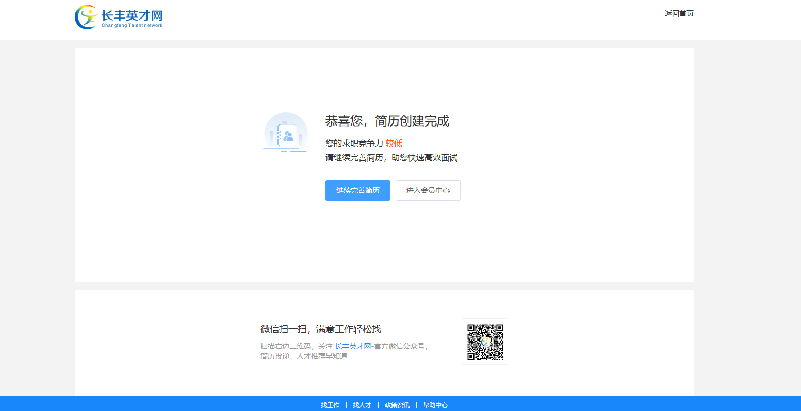

## 注册地址 <!-- {docsify-ignore} -->

- <a href="/doc/#/pc/regin/regin">进入注册页面方法</a>
- 也可点击<a href="http://www.ahcfrc.com/member/reg/personal" target="_blank">此处进入注册页面</a>

  > 开始注册

- 注册页面如下（<a href="/doc/#/pc/regin/personal?id=图1-1">图 1-1</a>）
- 1.填写手机号
- 2.获取验证码
- 3.填写收到的短信验证码
- 4.填写登录密码
- 5.点击注册按钮
- 6.填写基本信息及求职意向（<a href="/doc/#/pc/regin/personal?id=图1-2">图 1-2</a>）
- 7.填写工作经历，教育经历以及自我描述（<a href="/doc/#/pc/regin/personal?id=图1-3">图 1-3</a>）
- 8.完成注册,可继续进行简历完善,或寻找心仪的岗位（<a href="/doc/#/pc/regin/personal?id=图1-4">图 1-5</a>）

### 图 1-1 <!-- {docsify-ignore} -->

### 图 1-2 <!-- {docsify-ignore} -->

### 图 1-3 <!-- {docsify-ignore} -->

### 图 1-4 <!-- {docsify-ignore} -->

