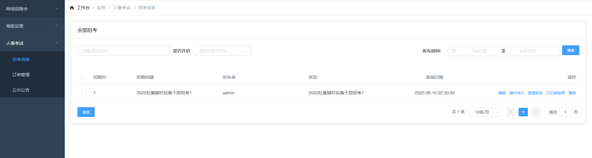
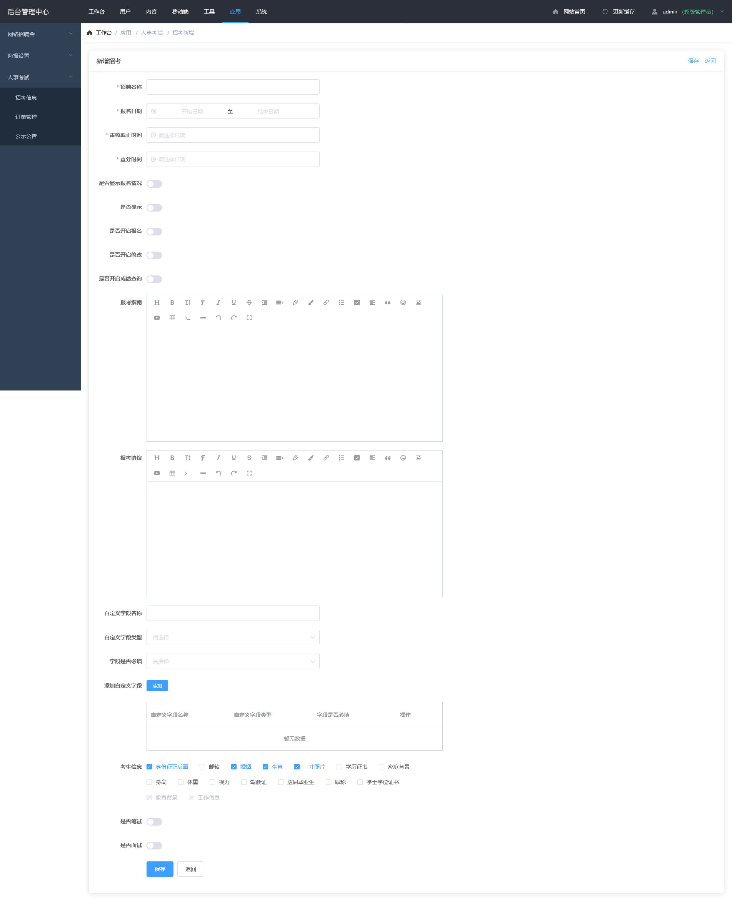

## 公示公告 <!-- {docsify-ignore} -->

## 列表

- 登录后台后点击顶部导航栏"应用"模块找到人事开始点击展开后点击招考信息(图 1-1)

## 添加

- 点击列表底部添加按钮可进入添加页面(图 1-2)

  > 内容填充

  - 招聘名称
  - 报名日期 - 时间范围,指定时间段内可报名
  - 审核截止时间
  - 查分时间 - 指定时间后可查分
  - 是否显示报名情况 - 控制考试是否可查看报名情况
  - 是否显示
  - 是否开启报名
  - 是否开启修改
  - 是否开启成绩查询
  - 报考指南 - 展示在报名页面第一页
  - 报考协议 - 考试点击报名时需要勾选协议
  - 自定字段 - 针对不同项目包括的资料,在系统默认没有的情况下补充(需要点击添加)
    - 名称
    - 类型 - 长/短文本,图片上传
    - 是否必填
  - 考生信息 - 控制资料字段控制
  - 是否笔试 - 是否开启笔试,必须开启
  - 笔试缴费金额 - 默认缴费金额
  - 笔试缴费日期 - 控制缴费时间段
  - 打印准考证日期 - 控制打印时间段
  - 笔试考试时间 - 打印准考证时展示
  - 笔试考试地址 - 打印准考证时展示
  - 笔试注意事项 - 打印准考证时展示
  - 是否面试 -是否开启面试
  - 面试缴费金额 - 默认缴费金额
  - 面试缴费日期 - 控制缴费时间段
  - 面试考试日期 - 打印准考证时展示
  - 面试考场 - 打印准考证时展示
  - 面试考试地址 - 打印准考证时展示
  - 打印面试表日期 - 控制打印时间段
  - 面试注意事项 - 打印准考证时展示

## 编辑

点击列表上的编辑按钮进入编辑页面,页面与添加一致

### 图 1-1<!-- {docsify-ignore} -->

### 图 1-2<!-- {docsify-ignore} -->

