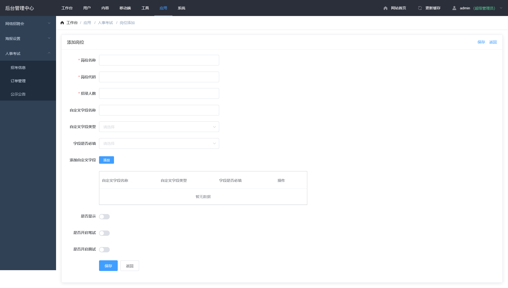

## 公示公告 <!-- {docsify-ignore} -->

## 列表

- 点击招考新增中的岗位管理(图 1-1)

## 添加

- 点击列表底部添加按钮可进入添加页面(图 1-2)

  > 内容填充

  - 岗位名称
  - 岗位代码
  - 招录人数
  - 是否显示
  - 自定字段 - 针对不同项目包括的资料,在系统默认没有的情况下补充(需要点击添加)
    - 名称
    - 类型 - 长/短文本,图片上传
    - 是否必填
  - 是否笔试 - 是否开启笔试,必须开启
  - 笔试缴费金额 - 缴费金额
  - 笔试考试时间 - 打印准考证时展示
  - 笔试考试地址 - 打印准考证时展示
  - 是否面试 -是否开启面试
  - 面试缴费金额 - 缴费金额
  - 面试考试日期 - 打印准考证时展示
  - 面试考试地址 - 打印准考证时展示

## 编辑

点击列表上的编辑按钮进入编辑页面,页面与添加一致

### 图 1-1<!-- {docsify-ignore} -->

### 图 1-2<!-- {docsify-ignore} -->

