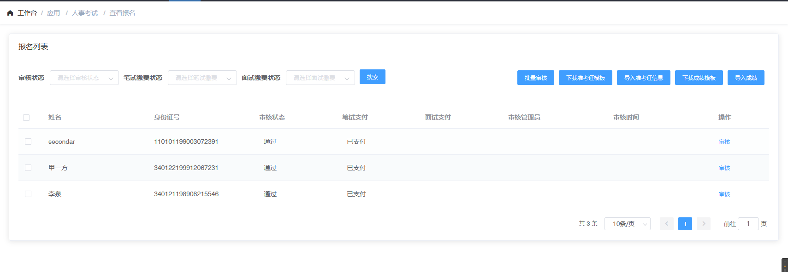
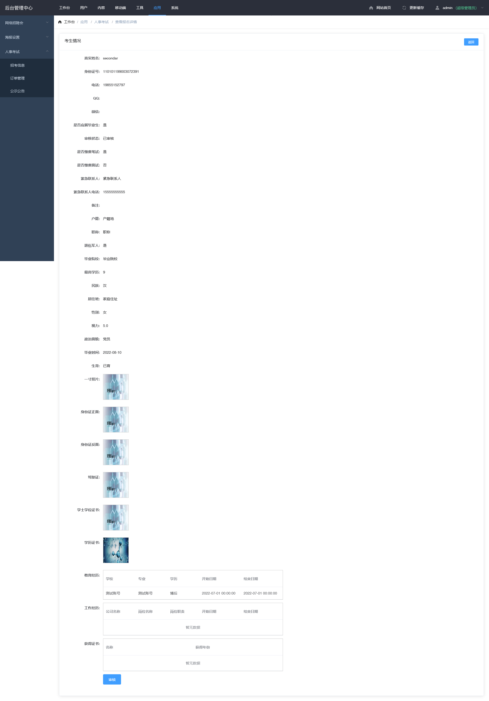
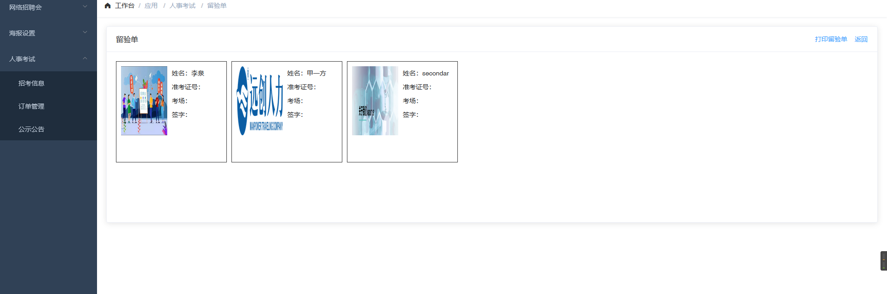

## 公示公告 <!-- {docsify-ignore} -->

## 列表

- 点击招考信息中的报名列表

## 添加

- 点击列表底部添加按钮可进入添加页面(图 1-1)

  > 内容填充

  - 批量审核 - 选中列表左侧的复选框,点击批量审核按钮即可批量审核(不可查看详情)
  - 审核 - 点击报名列表中的审核按钮即可查看详细报名信息,底部可进行单独审核(图 1-2)

## 编辑

点击列表上的编辑按钮进入编辑页面,页面与添加一致

## 笔试准考证设置

- 点击下载准考证模板
- 根据表格填写考场及准考证号即可
- 根据表格填写后点击导入准考证导入回即可

## 成绩导入

- 点击下载成绩导入模板
- 根据表格填写成绩及设置是否进入面试
- 根据表格填写后点击导入准考证导入回即可

## 打印留验单

点击列表上的打印留验单按钮即可进入打印(图 1-3)

### 图 1-1<!-- {docsify-ignore} -->

### 图 1-2<!-- {docsify-ignore} -->

### 图 1-3<!-- {docsify-ignore} -->

