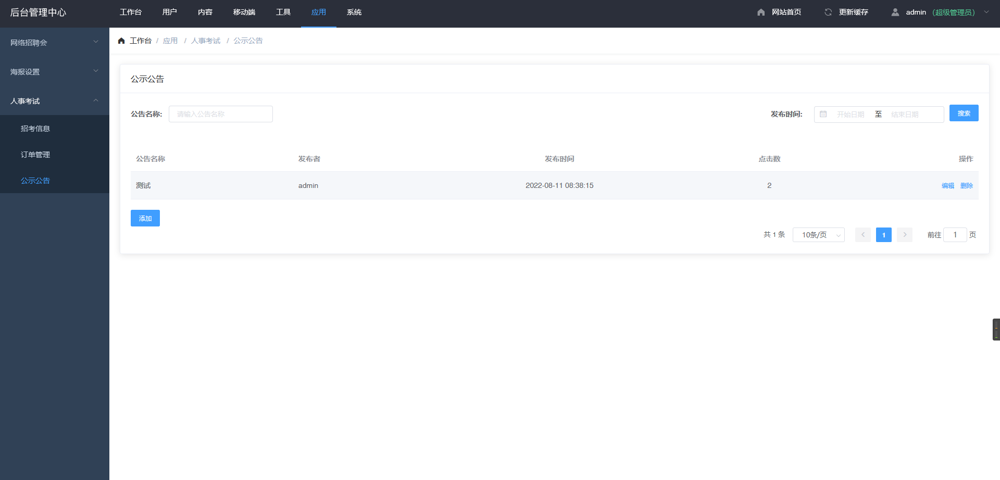
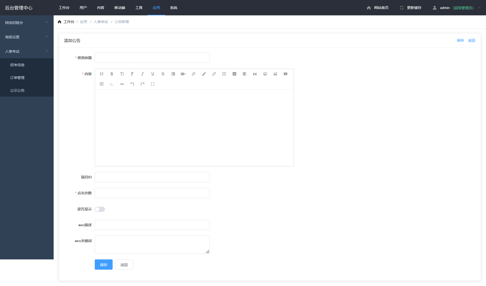

## 公示公告 <!-- {docsify-ignore} -->

## 列表

- 登录后台后点击顶部导航栏"应用"模块找到人事开始点击展开后点击公示公告(图 1-1)

## 添加

- 点击列表底部添加按钮可进入添加页面(图 1-2)

  > 内容填充

  - 填写资讯标题为公告标题
  - 填写内容,编辑器可全屏(不建议从 word 文档中复制,因为 word 文档中会携带 word 专有标签)
  - 项目 ID 为页面内报名按钮,需要添加招考后展现在列表中的 招考 ID 填写至这里
  - 点击次数 默认 0,可自定义,展示在用户有页面中的点击数
  - 是否展示,默认不展示
  - seo 描述 给百度搜索引擎使用,一般为标题或内容简写
  - seo 关键词 给百度搜索引擎使用
## 编辑
  点击公告上的编辑按钮进入编辑页面,页面与添加一致
### 图 1-1<!-- {docsify-ignore} -->

### 图 1-2<!-- {docsify-ignore} -->

