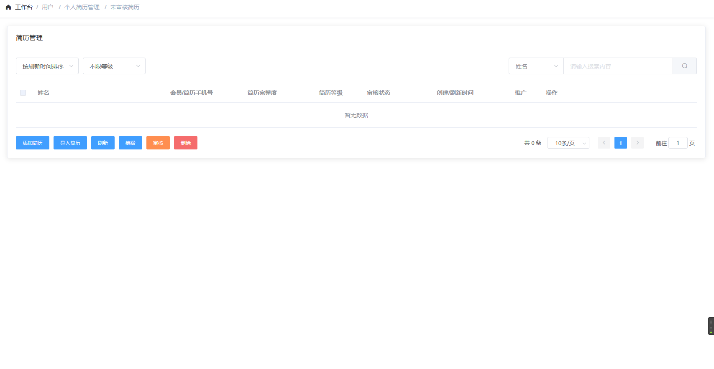
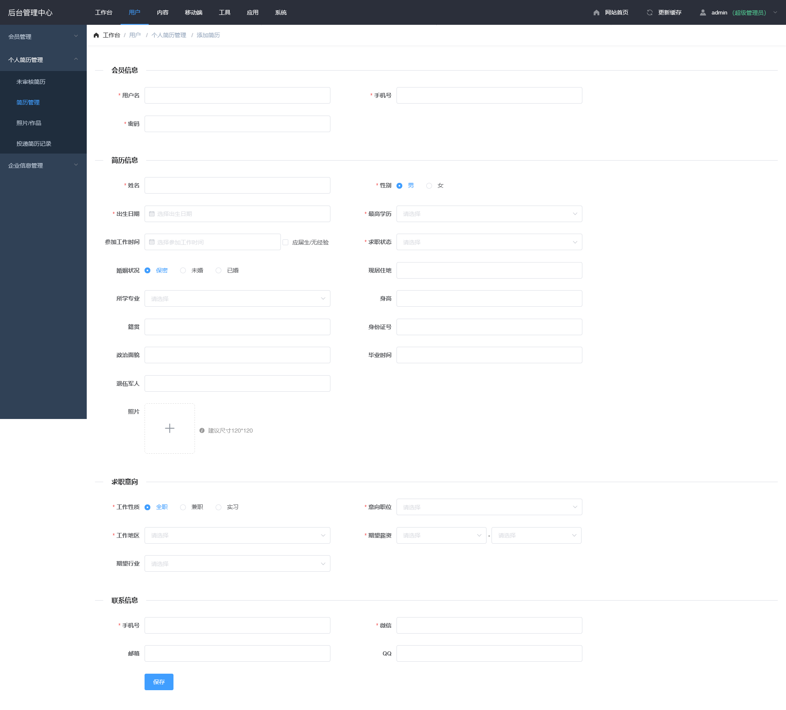
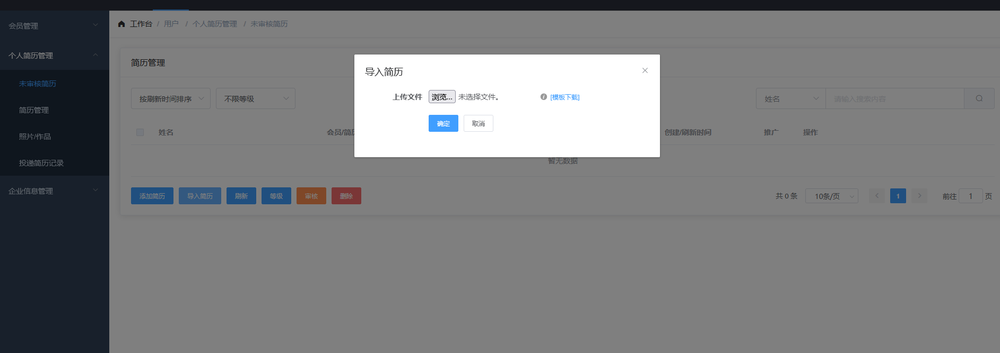
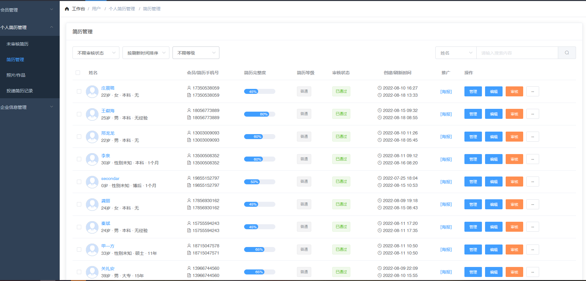
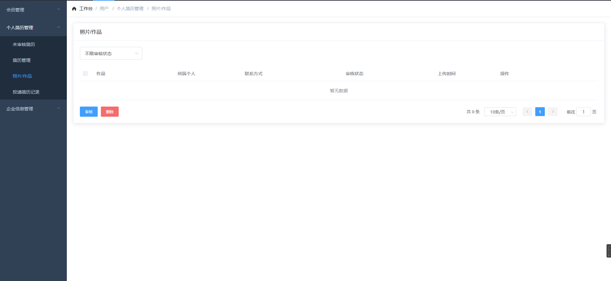
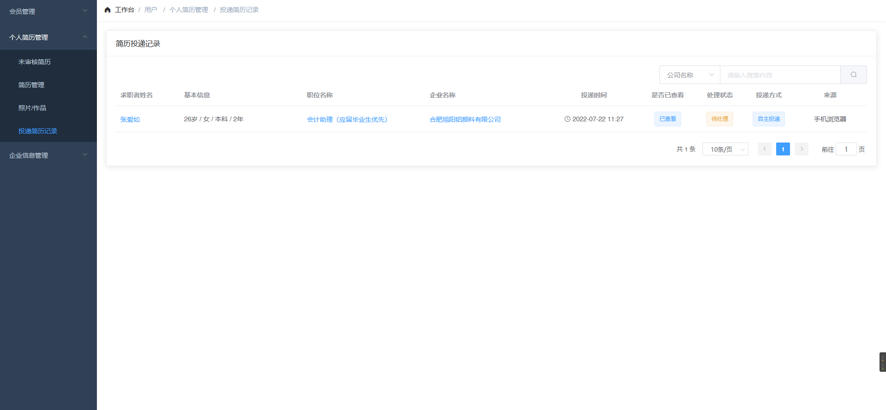

## 个人简历管理 <!-- {docsify-ignore} -->

## 未审核简历 / 简历管理
  > 仅在设置中开启简历审核才会生效(图1-1)
  - 列表展示
    - 姓名
    - 会员/简历手机号
    - 简历完善度
    - 简历等级
    - 审核状态
    - 创建/刷新时间
    - 操作
## 操作按钮
 - 手动添加(图1-2)
 - 导入 (图1-3)
 - 设置等级
 - 审核
 - 删除
## 照片/作品
  > 个人会员提交的照片/作品列表
## 简历投递状态
  > 个人会员简历投递状态 仅可查看
### 图 1-1<!-- {docsify-ignore} -->

### 图 1-2<!-- {docsify-ignore} -->

### 图 1-3<!-- {docsify-ignore} -->

### 图 1-4<!-- {docsify-ignore} -->

### 图 1-5<!-- {docsify-ignore} -->

### 图 1-6<!-- {docsify-ignore} -->

